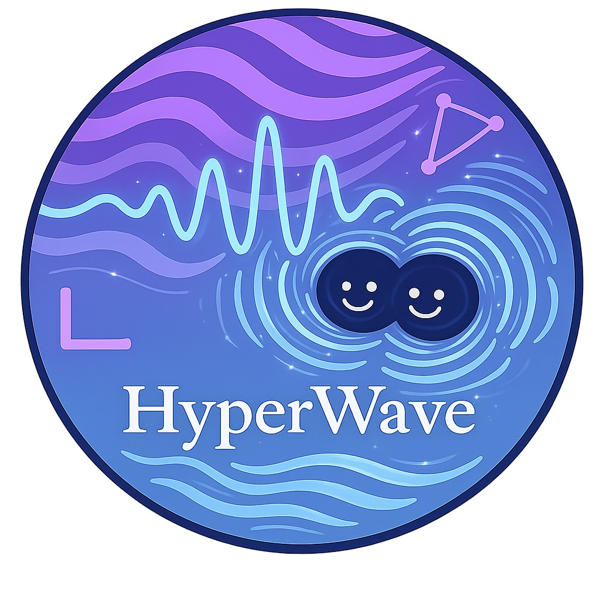

<p align="center">
  
</p>

# HyperWave

HyperWave is a Python package for robust gravitational-wave inference with hyperbolic likelihoods. It combines detector/noise utilities, waveform-facing likelihood code, inference helpers, and plotting tools for studying non-Gaussian noise and glitch-tolerant parameter estimation.

## What the package provides

- Hyperbolic and Gaussian likelihoods for GW data analysis
- Frequency-domain utilities for data-only noise studies
- LVK-oriented detector and waveform helpers
- Eryn and pocoMC based inference helpers
- Plotting utilities and example notebooks for common workflows

## Installation

HyperWave uses `pyproject.toml` and can be installed directly from a checkout.

```bash
git clone https://github.com/asasli/HyperWave.git
cd HyperWave
python -m venv .venv
source .venv/bin/activate
pip install --upgrade pip
pip install .
```

Optional extras:

- `pip install .[plot]` installs `corner` and `chainconsumer`
- `pip install .[sampling]` installs `pocomc`
- `pip install .[gpu]` installs the CUDA 12 CuPy build
- `pip install .[dev]` installs packaging and test tooling

If you want a Jupyter kernel, install it explicitly in your environment:

```bash
pip install ipykernel
python -m ipykernel install --user --name hyperwave --display-name "HyperWave"
```

## GPU support

GPU acceleration is optional and explicit. HyperWave always runs on CPU with NumPy. If you install a compatible CuPy build and pass `gpu=True`, the likelihood classes will use CuPy for array-heavy operations and otherwise fall back to NumPy with a warning.

Important notes:

- Install only one CuPy package in an environment
- `.[gpu]` is a convenience extra for CUDA 12 environments
- If you use another CUDA version, install the matching CuPy wheel manually
- Waveform generation is still driven by the template object, so speedups mainly apply to residual and likelihood algebra

Example:

```python
from hyperwave.likelihoods import GWLikelihoods, gpu_backend_available

likelihood = GWLikelihoods(
    data=dataf,
    f=freqs,
    ifos_list=["H1", "L1"],
    noise=noise_psd,
    template=template,
    nsegs=4,
    gpu=True,
)

print("GPU visible:", gpu_backend_available())
print("Backend in use:", likelihood.backend_name)
```

## Quick start

```python
import numpy as np

from hyperwave.likelihoods import GWLikelihoods


class Template:
    parameters = ["amplitude"]

    def make_injections_to_ifo(self, theta):
        amplitude = float(theta[0])
        return {
            "H1": amplitude * np.ones(1024, dtype=np.complex128),
            "L1": amplitude * np.ones(1024, dtype=np.complex128),
        }


freqs = np.linspace(20.0, 1024.0, 1024)
dataf = np.zeros((2, 1024), dtype=np.complex128)
noise_psd = np.ones((2, 1024))

likelihood = GWLikelihoods(
    data=dataf,
    f=freqs,
    ifos_list=["H1", "L1"],
    noise=noise_psd,
    template=Template(),
    nsegs=1,
    gpu=False,
)

theta = np.array([[0.0]])
print(likelihood.gaussian(theta))

# Real inference runs require meaningful priors and sampler settings.
# driver = LVKinference(...)
```

## Package layout

- `hyperwave/likelihoods/`: likelihood implementations
- `hyperwave/inference/`: sampler-facing helpers
- `hyperwave/detectors/`: LVK noise and waveform utilities
- `hyperwave/plots/`: plotting helpers
- `hyperwave/examples/`: notebooks and scripts

## Development notes

- The package metadata in `pyproject.toml` defines optional extras for plotting, sampling, and GPU support
- Example notebooks live in the repository and are not installed as runtime dependencies
- Generated directories such as `build/`, `dist/`, and `*.egg-info/` are ignored by `.gitignore`

## Contributing

Issues and pull requests are welcome:

- https://github.com/asasli/HyperWave/issues
- https://github.com/asasli/HyperWave/pulls

## Authors

- A. Sasli
- N. Karnesis
- M. Karamanis
- M. W. Coughlin
- V. Mandic
- N. Stergioulas

## Funding

Development of HyperWave has been supported in part by:

- U.S. National Science Foundation HDR Institute for Accelerating AI Algorithms for Data Driven Discovery (A3D3), Cooperative Agreement PHY-2117997
- Bodossaki Foundation

## License

HyperWave is released under the MIT License. See [LICENSE](LICENSE).
